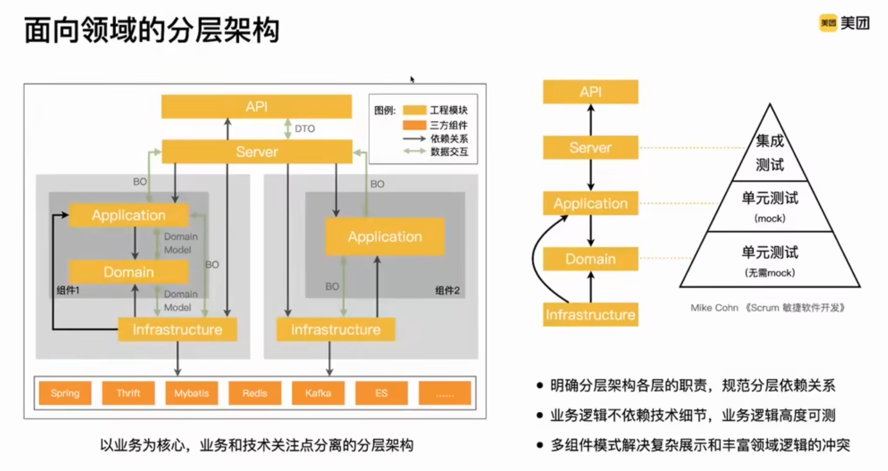

# 架构

[系统架构](https://www.bilibili.com/video/BV11u411176h/?spm_id_from=333.1391.0.0&vd_source=b6de81147592c93c776e15c76f7fbfa0)

[DDD 六边形架构](https://github.com/bitloops/ddd-hexagonal-cqrs-es-eda)

域驱动设计 （DDD）
六边形架构
CQRS
事件溯源 （ES）
事件驱动架构 （EDA）
行为驱动开发 （BDD）

Hexagonal Architecture (or Ports and adapters)
六边形建筑（或端口和适配器）
Domain Driven Design (DDD) and its tactical patterns
域驱动设计（DDD）及其战术模式
Behaviour Driven Development (BDD)
行为驱动的发展（BDD）
Event Driven Architecture (EDA)
事件驱动的建筑（EDA）
Command and Query Responsibility Segregation (CQRS)
命令和查询责任隔离（CQRS）
Eventual consistency
最终的一致性
Event Storming事件猛烈袭击
